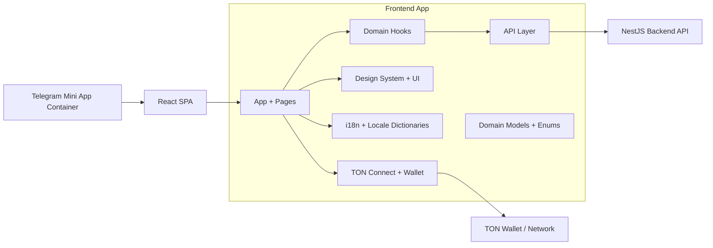

# PostGramX Frontend

[](https://github.com/AndrewwPataleta/postgramx-frontend/actions/workflows/ci.yml)

Telegram Mini App frontend for a two-sided ads marketplace, where channel owners and advertisers make deals with escrow-based payments. Built with React, Vite and TypeScript. Pairs with the PostGramX NestJS backend.


## What this project shows

- Product-first UX for a two-sided ads marketplace
- Telegram Mini App flow with auth and context bootstrap
- Type-safe frontend with shared domain models and enums
- Deal, channel and listing flows aligned with an escrow lifecycle
- i18n (English and Russian) and a Radix + Tailwind design system

## Architecture



## Project structure

All source lives under `client/src`:

- `app/App.tsx` - app bootstrap and route wiring
- `pages/` - screens: marketplace, channels, deals, listings, add/manage channel
- `hooks/` - domain hooks (`use-deals`, `use-deals-overview`, `useTransactions`, `useBalanceOverview`, `use-telegram`)
- `api/` - API clients (payments, balance, transactions)
- `models/` - shared domain entities, inputs and enums
- `constants/` - routes, roles, deals, payments, channels, UI constants
- `contexts/` - React contexts (TON wallet)
- `telegram/` and `lib/telegram.ts` - Telegram Mini App integration and init data
- `lib/ton.ts` - TON helpers
- `i18n/` - language provider, translations and formatters (en / ru)
- `theme/` - theming provider, storage and utilities
- `layout/` - app shell
- `components/` - shared UI components

## User flows

- Marketplace discovery, channel and listing details
- Deal creation and deal-stage progression
- Escrow payment and verification states
- Channel onboarding and management
- Wallet connection and balance views

## Tech stack

- React 18 + TypeScript
- Vite
- React Router 6
- TanStack Query
- TailwindCSS 3 + Radix UI
- TON Connect (`@tonconnect/ui-react`)
- Zod

## Quick start

```bash
# 1. install
npm install

# 2. create your env from the example (defaults run against a local backend in mock mode)
cp .env.example .env.local

# 3. run — with VITE_TELEGRAM_MOCK=true the mini app runs in a normal browser
npm run dev
```

Point `VITE_API_BASE_URL` at a running PostGramX backend. With `VITE_TELEGRAM_MOCK=true` the Telegram SDK is mocked so you can develop and review the app outside of Telegram.

### Environment variables

See `.env.example`. In short:

- `VITE_API_BASE_URL` - base URL of the backend API
- `VITE_TELEGRAM_MOCK` - mock the Telegram SDK to run in a browser (`true` for local dev)
- `VITE_ENV_MODE` - environment label (`local` / `stage` / `production`)
- `VITE_API_LOG` - log API requests to the console
- `VITE_API_TRIPLE_PAYMENT_REQUESTS` - internal payment-retry flag, leave `false`

### Other scripts

```bash
npm run build       # production build
npm run start       # preview the build
npm run typecheck   # tsc
npm run test        # vitest
npm run lint        # eslint
```

## License

MIT - see [LICENSE](./LICENSE).
