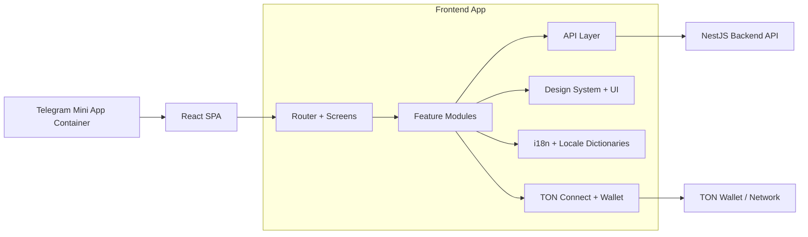

# PostGramX Frontend

Frontend for a Telegram Mini App marketplace for ads with TON escrow integration. This repository contains proprietary software.


## What this project shows

- Product-first UX for a two-sided ads marketplace
- Telegram Mini App first flow with auth/context bootstrap
- Type-safe frontend architecture with shared domain models
- Deal/channel/listing flows aligned with escrow lifecycle
- Production-ready frontend foundation with i18n and design system

## Architecture preview



## Core concept

The frontend is organized around explicit product domains and user journeys.
Main app capabilities are grouped by feature slices:

- `features/deals` for deal lifecycle views and stage-specific UI
- `features/channels` and `features/channel-manage` for channel ownership and moderation
- `features/listings` and `features/marketplace` for discovery and publication inventory
- `features/auth` and `features/wallet` for access control and TON connect flows

This structure keeps business flows close to the UI and API integration points.

## User flow highlights

Main user journeys in UI:

- Marketplace discovery and channel/listing details
- Deal creation and deal stage progression screens
- Escrow payment and verification states
- Channel onboarding and management workflows
- Wallet connection and balance-related interactions

## Documentation map

- `client/src/app/App.tsx` — app bootstrap and route wiring
- `client/src/app/routes/index.tsx` — route tree and navigation entry points
- `client/src/features/deals/` — deal lifecycle UI, stage mapping, filters
- `client/src/features/channels/` — channels domain hooks, api and UI
- `client/src/features/listings/` — listings domain hooks, api and UI
- `client/src/features/marketplace/` — marketplace views and view models
- `client/src/features/wallet/` — TON wallet integration facade
- `client/src/i18n/locales/en.json` and `client/src/i18n/locales/ru.json` — locale dictionaries

## Tech stack

Frontend:

- React 18
- TypeScript
- Vite
- React Router 6
- TanStack Query
- TailwindCSS 3 + Radix UI
- TON Connect (`@tonconnect/ui-react`)
- Zod

## Launch

### 1) Install dependencies

```bash
pnpm install
```

### 2) Select runtime environment (`mode`)

This frontend uses Vite modes and env files:

- `.env.local` for local/dev values
- `.env.stage` for stage-like values
- `.env.production` for production values

Run scripts select mode explicitly.

### 3) Fill key env values

Most important frontend runtime values:

- `VITE_API_URL`: base URL of backend API
- `VITE_APP_URL`: current frontend URL (used in integrations/redirects)
- `VITE_BOT_NAME`: Telegram bot name used in links
- `VITE_TELEGRAM_BOT_LINK`: bot deep-link URL
- `VITE_TON_MANIFEST_URL`: TON Connect manifest URL

> Keep real production URLs and integration values in secure deployment config.

### 4) Start frontend

```bash
# local development mode
pnpm dev:local

# stage-like mode
pnpm dev:stage

# production-like mode
pnpm dev:production
```

Default shortcut:

```bash
pnpm dev
```

### 5) Build / preview

```bash
pnpm build
pnpm start
```

Mode-specific build/start commands are available as well:

```bash
pnpm build:local
pnpm build:stage
pnpm build:production

pnpm start:local
pnpm start:stage
pnpm start:production
```

### 6) Quality checks

```bash
pnpm typecheck
pnpm test
pnpm i18n:check
pnpm i18n:lint
```

## Security notes

- Do not expose private keys, mnemonics, backend secrets, or admin tokens in frontend envs.
- Keep only public runtime config in `VITE_*` variables.
- Store sensitive credentials only on backend/secret manager side.
- Validate all business-critical operations on backend even if frontend has guards.

## Legal and repository protection

### License and ownership

- Copyright (c) 2026 PatStudio LLC. All rights reserved.
- This codebase is **proprietary / closed-source** (not open-source).
- No one may use, copy, modify, or distribute this code without written permission from PatStudio LLC.

### GitHub visibility and access

- GitHub hosting does **not** automatically make a project open-source.
- Keep the repository **Private** for commercial core logic whenever possible.
- If needed, split architecture into:
  - private business logic/core
  - public SDK/client wrappers
  - public documentation and integration guides
